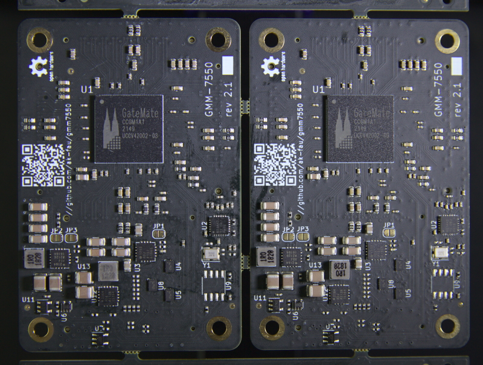
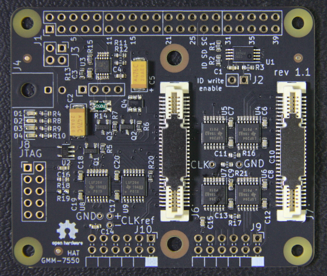
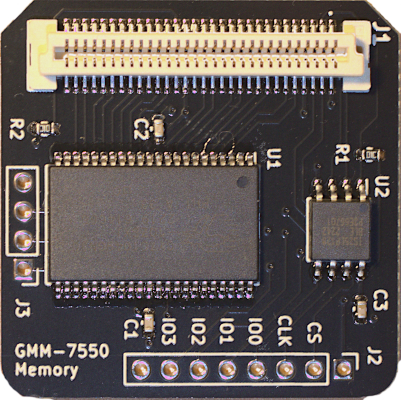
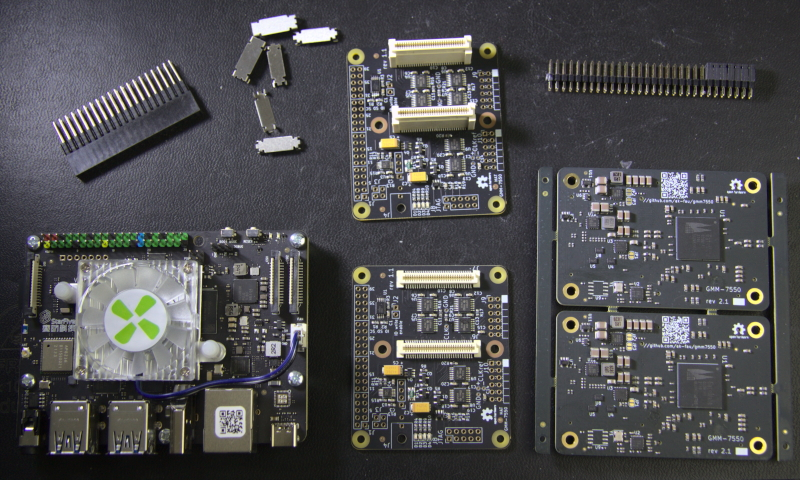

# CologneChip GateMate FPGA Module: GMM-7550

**June 2022 Update**
After more than two years of development and delays
the module and adapter boards are out of production.

Tests are underway, no problems discovered so far, updates
are expected in a few weeks.

This project is licensed under [CERN-OHL-P v2](./cern_ohl_p_v2.txt)

Current module revision is 2.1 -- it is updated to the latest
(flip-chip) GateMate FPGA pin out. The other changes are complete
redesigns of the power and clock subsystems due to component
availability.

[Schematic (pdf) version 2.1](./doc/GMM-7550_2.1_2022-04-24.pdf)

## 40-pin GPIO (R-Pi HAT) Adapter for GMM-7550 Module

The adapter board provides power to the GMM-7550 module (5V from
40-pin GPIO or from an external connector), I2C and SPI interfaces,
control over the module power enable and reset signals and module
power consumption monitoring.

Two 12-pin Pmod extension connectors are routed to the GateMate
FPGA South GPIO pins through 2.5/3.3 bi-directional level converter.

[Schematic (pdf) version 1.1](./doc/HAT-GMM-7550_1.1_2022-04-24.pdf)

## Memory Extension Module

The module provides 512Kx8 static RAM (CY7C1049GN30-10ZSXI) with 10 ns
access time and 16 MiB QSPI NOR FLASH (S25LP128-JBLE). The module may
be connected to P1, P2 or P3 connector of the GMM-7550, up to three
modules may be connected simultaneously. An SPI Bridge example design
for FPGA routes SPI from a host (R-Pi or VisionFive board) to the
module connector and allows to access the SPI NOR chip on the module
from the host. The module control software provides commands to
automate the FPGA configuration and access to the SPI on the extension
module.

[Schematic (pdf) version 1.0](./doc/MEM-GMM-7550_1.0_2023-04-24.pdf)

## Test and Demo System based on VisionFive RISC-V SBC

The SBC runs [`buildroot`](https://buildroot.org/) embedded Linux,
experimental
[configuration for the VisionFive board](https://github.com/ak-fau/buildroot-visionfive/)
is available as a `buildroot`-external tree.

