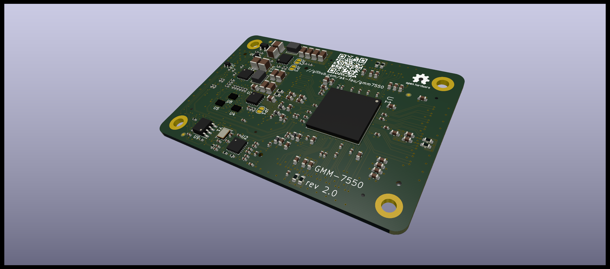
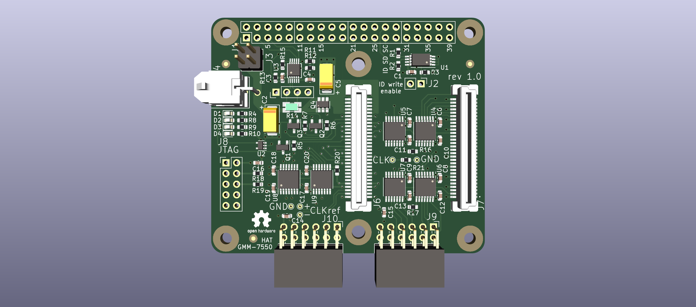

# CologneChip GateMate FPGA Module: GMM-7550

Current module revision is 2.0 -- it is updated to the latest
(flip-chip) GateMate FPGA pin out. The other changes are complete
redesigns of the power and clock subsystems due to component
availability.

[Schematic (pdf) version 2.1](./doc/GMM-7550_2.1_2022-04-24.pdf)

## 40-pin GPIO (R-Pi HAT) Adapter for GMM-7550 Module

The adapter board provides power to the GMM-7550 module (5V from
40-pin GPIO or from an external connector), I2C and SPI interfaces,
control over the module power enable and reset signals and module
power consumption monitoring.

Two 12-pin Pmod extension connectors are routed to the GateMate
FPGA South GPIO pins through 2.5/3.3 bi-directional level converter.

[Schematic (pdf) version 1.1](./doc/HAT-GMM-7550_1.1_2022-04-24.pdf)

This project is licensed under [CERN-OHL-P v2](./cern_ohl_p_v2.txt)
