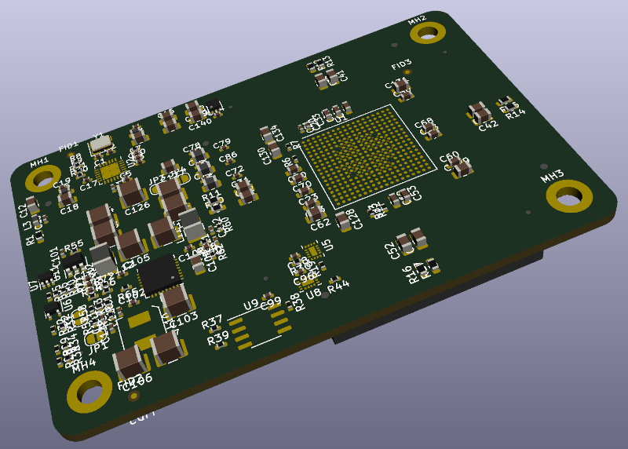

# CologneChip GateMate FPGA Module: GMM-7550

**WARNING**

Current version of the design is based on the preliminary data
from the CologneChip and **has to be updated** prior
the hardware manufacturing.

Quote from an e-mail from CologneChip technical support:

> Unfortunately the pinout had to be changed slightly. We are
> still waiting for feedback and information from our packager.
> I would ask you to wait with hardware manufacturing until
> we have the data

[Schematic (pdf) version 1.0](./doc/GMM-7550_1.0_2020-10-01.pdf)

This project is licensed under [CERN-OHL-P v2](./cern_ohl_p_v2.txt)
